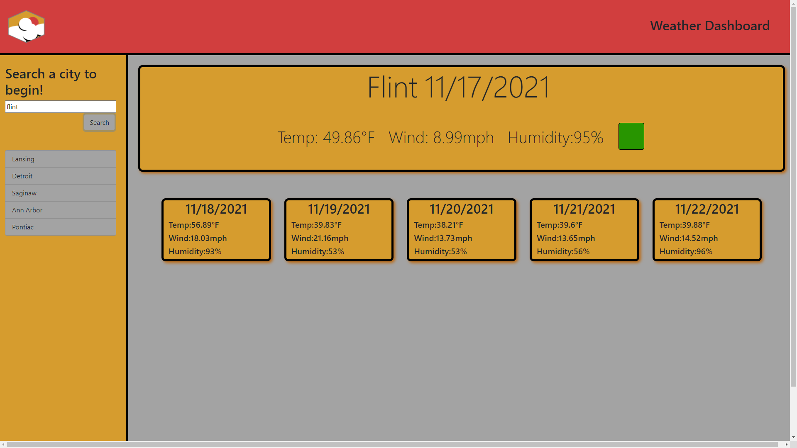

 
# Weather Dashboard

## Description
Makes multiple calls to openweatherapi in order to bring the user current weather data as well as a five day forcast. It stores previously searched citys and replaces the ones under the search bar with them upon reload. Check it out here [My Weather Dashboard](https://krestle80.github.io/weatherDashboard/)
## Table of Contents
- #### [Description](##-description)
- #### [Usage Information](##-usage-information)
- #### [License](##-license)
- #### [Questions](##-questions)

## Usage Information
Type in the name of a city and hit search, or click one of the city names below the search bar.
## License
Copyright  2021  Kyle Costello 
 
 Licensed under the Apache License, Version 2.0 (the "License");
 you may not use this file except in compliance with the License.
 You may obtain a copy of the License at
 
 http://www.apache.org/licenses/LICENSE-2.0
 
 Unless required by applicable law or agreed to in writing, software
 distributed under the License is distributed on an "AS IS" BASIS,
 WITHOUT WARRANTIES OR CONDITIONS OF ANY KIND, either express or implied.
 See the License for the specific language governing permissions and
 limitations under the License.

## Questions
If you have any questions regarding this project please feel free to reach out at 

-Email: kylec0217@gmail.com 
-GitHub Username: krestle80 
